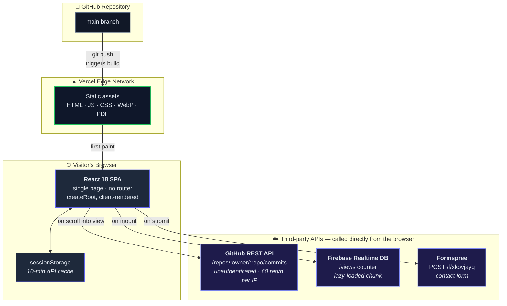
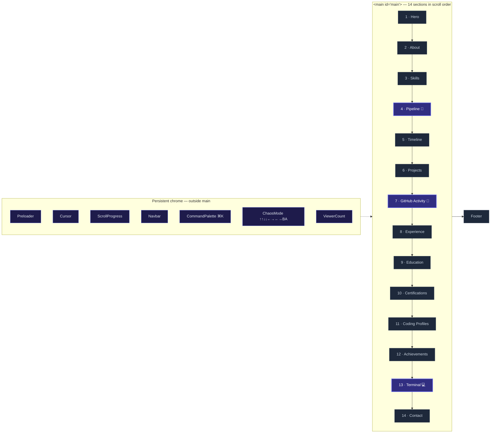
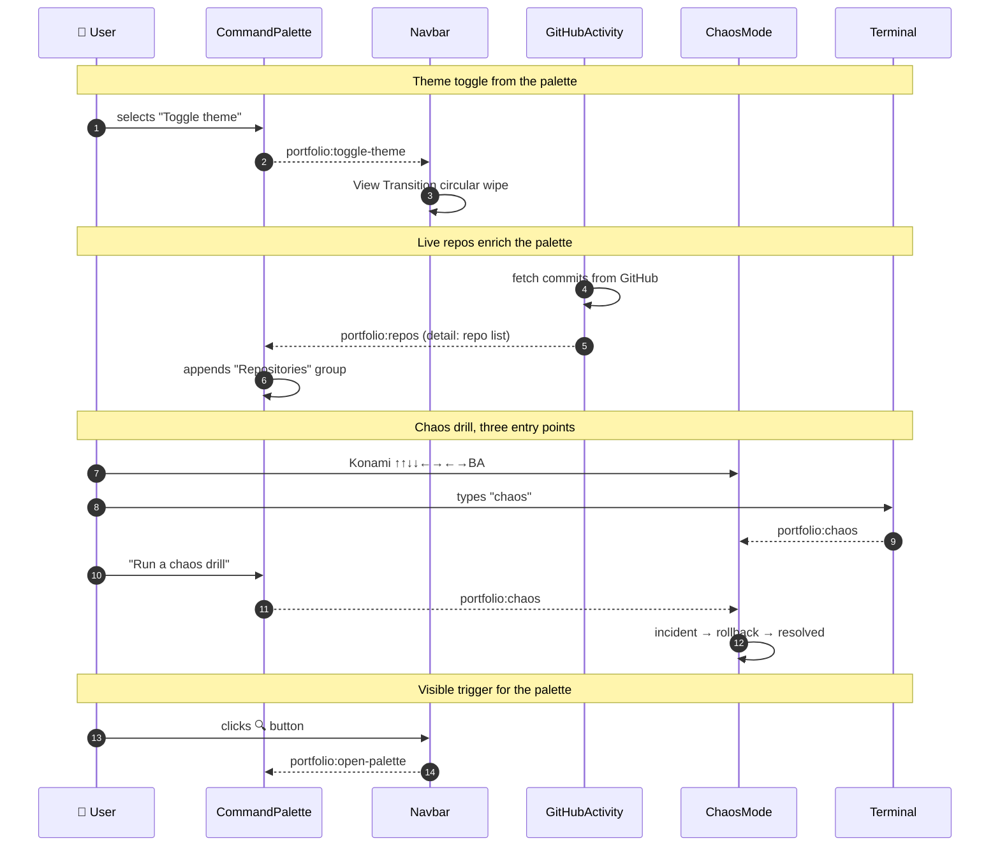
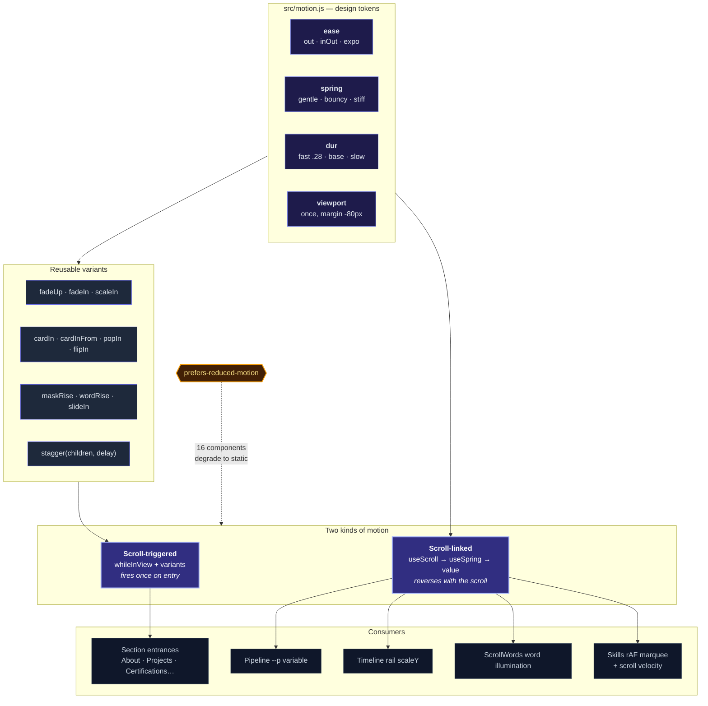
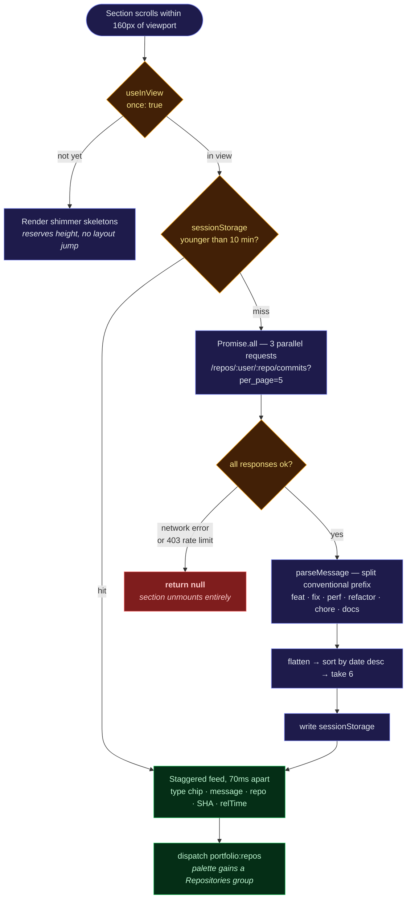
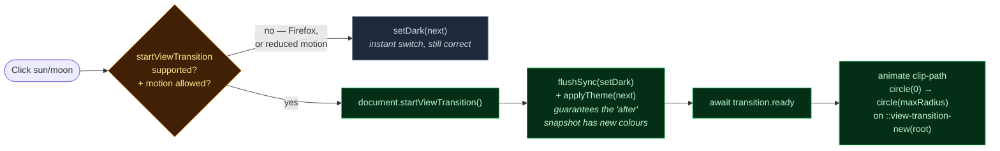
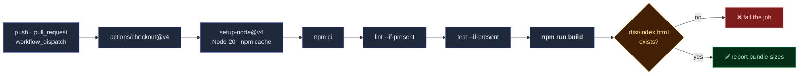
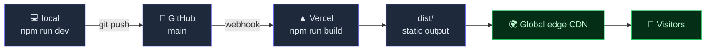

<div align="center">

# Sridhar Cloud Portfolio

**Portfolio of Yatham Sridhar Reddy — Full-Stack Software Developer | Cloud &amp; DevOps.**<br/>A single-page React application where the interface performs the disciplines it advertises.

[](https://yathamsridharreddy.vercel.app/)
[](https://react.dev)
[](https://vite.dev)
[](https://motion.dev)
[](https://github.com/yathamsridharreddy/sridhar-portfolio/actions/workflows/ci.yml)
[](#performance-budget)

</div>

---

## At a glance

**Purpose** — a portfolio that lets a recruiter or interviewer verify real engineering ability in about a minute, rather than reading a list of adjectives. It targets **Full-Stack / SDE** and **Cloud / DevOps** roles equally.

| | |
|---|---|
| 🔗 **Live demo** | **[yathamsridharreddy.vercel.app](https://yathamsridharreddy.vercel.app/)** |
| 🐙 **This repository** | [github.com/yathamsridharreddy/sridhar-portfolio](https://github.com/yathamsridharreddy/sridhar-portfolio) |
| 📄 **Résumé** | [sridhar_final-resume.pdf](https://yathamsridharreddy.vercel.app/sridhar_final-resume.pdf) |
| 🏅 **Certifications** | [Credly profile](https://www.credly.com/users/yatham-sridhar-reddy) |

### Tech stack

| Layer | Technologies |
|---|---|
| **Frontend** | React 18 · Vite 7 · Framer Motion 12 · plain CSS with custom properties |
| **Backend / services** | Firebase Realtime Database (view counter) · Formspree (contact) · GitHub REST API (live commit feed) |
| **Architecture** | Static SPA, no server runtime — every dynamic feature is a direct browser-to-API call |
| **CI/CD** | GitHub Actions (install → lint if present → test if present → production build) |
| **Deployment** | Vercel, auto-deploying from `main` to a global edge CDN |

### Featured projects

Two projects, presented as **equal in weight and different in kind** — one a cloud-deployed full-stack platform, the other a real-time distributed system.

<table>
<tr>
<th width="50%">☁️ CloudCompare AI</th>
<th width="50%">🏎️ Sridhar Rush</th>
</tr>
<tr>
<td valign="top">

**Full-Stack · Cloud &amp; DevOps**

Multi-cloud comparison and recommendation platform spanning AWS, Azure, GCP, Oracle Cloud and Alibaba Cloud.

```
React 19 (S3)
      ↓
Amazon API Gateway
      ↓
Spring Boot 3.2.5 (Docker on EC2)
      ↓
Amazon RDS for MySQL (private)
```

`Java 21` `Spring Boot` `React 19` `REST APIs`
`MySQL` `AWS` `Terraform` `Docker` `Jenkins`

Provisioned end to end with **Terraform**; built and quality-gated through **Jenkins** and **SonarQube**.

[Live](https://cloud-compareai.vercel.app/) · [Code](https://github.com/yathamsridharreddy/CLOUD-COMPARE-AI)

</td>
<td valign="top">

**Full-Stack · Real-Time Systems**

Real-time 3D multiplayer racing. The laptop renders the race; a phone becomes the gamepad over a QR scan.

```
Browser clients (laptop + phone)
      ↓  wss
Node · Express · ws relay
   authoritative, 30Hz
      ↓
Supabase Postgres
```

`JavaScript` `Node.js` `Express` `WebSockets`
`Three.js` `Supabase` `PWA` `Vercel`

The relay is **authoritative at 30Hz**; clients interpolate between updates rather than simulating independently.

[Live](https://sridhar-drift.vercel.app/) · [Code](https://github.com/yathamsridharreddy/MULTIPLAYER-CAR-GAME)

</td>
</tr>
</table>

> Each project opens an in-site case study covering Problem, Solution, Architecture, Frontend, Backend, Database, Cloud/Infrastructure, CI/CD and Key Engineering Decisions — every fact sourced from that project's own repository.

---

## Table of contents

- [At a glance](#at-a-glance)
- [The idea](#the-idea)
- [System architecture](#system-architecture)
- [Page composition](#page-composition)
- [Signature features](#signature-features)
- [The event bus](#the-event-bus)
- [Motion architecture](#motion-architecture)
- [Live GitHub feed — data flow](#live-github-feed--data-flow)
- [Theme switching](#theme-switching)
- [Tech stack](#tech-stack)
- [Repository layout](#repository-layout)
- [Getting started](#getting-started)
- [Performance budget](#performance-budget)
- [Accessibility](#accessibility)
- [External services](#external-services)
- [Continuous integration](#continuous-integration)
- [Deployment](#deployment)

---

## The idea

Most developer portfolios *describe* what someone can do. This one **demonstrates** it.

A CI/CD pipeline that advances as you scroll. A terminal that answers real commands. A commit feed pulled live from the GitHub API. A chaos drill that stages a production incident and rolls it back. None of it is decoration — each piece performs a skill the CV claims, which is the difference between saying *"I know Kubernetes"* and showing a rollback complete in 47 seconds.

Three constraints held throughout:

| Constraint | Why |
|---|---|
| **No new dependencies** | Six runtime packages, total. Every feature is built on what is already installed or on a native browser API. |
| **`prefers-reduced-motion` honoured everywhere** | 16 of 29 components read the media query and degrade to a static, correct state. |
| **Transform / opacity only** | Compositor-friendly properties, so animation stays off the layout thread. |

---

## System architecture

The site is a static SPA. There is no backend, no server runtime and no database owned by this project — every dynamic capability is a direct browser-to-API call, which is what keeps hosting free and cold starts nonexistent.



**Why no backend.** Every feature that *looks* like it needs a server — the view counter, the contact form, the commit feed — is delegated to a service with a public browser SDK or a CORS-open REST endpoint. The result is a site that costs nothing to run, cannot go down independently of its CDN, and has no secrets worth stealing (the Firebase web config is public by design; access is governed by database rules, not by hiding the key).

---

## Page composition

`App.jsx` is deliberately flat and declarative — the entire page reads top to bottom in one screen. Four components sit *outside* `<main>` because they are chrome, not content.



> Sections highlighted in **indigo** are the four that do more than present text.

---

## Signature features

### 🔧 Delivery Pipeline — *scroll drives a single CSS variable*

Five CI/CD stages light up as you scroll, with a payload travelling the wire between them.

The trick is that **scroll position writes exactly one CSS custom property**, `--p`, onto the section. Everything downstream reads from it, which means *the stylesheet alone* decides orientation:

```css
/* desktop — horizontal */
.pipelineWire  { transform: scaleX(var(--p)); }
.pipelinePayload { left: calc(var(--p) * 100%); }

/* under 720px — vertical, same variable */
@media (max-width: 720px) {
  .pipelineWire  { transform: scaleY(var(--p)); }
  .pipelinePayload { top: calc(var(--p) * 100%); }
}
```

No JavaScript breakpoint. No resize listener. The raw `scrollYProgress` is passed through `useSpring({ stiffness: 120, damping: 30 })` first — without it the payload tracks the wheel 1:1 and reads as jitter on a trackpad.

| Stage | Command |
|---|---|
| Commit | `git push origin main` |
| Build | `docker build -t app .` |
| Test | `pytest --cov` |
| Deploy | `kubectl apply -f k8s/` |
| Monitor | `prometheus targets` |

### 💻 Interactive Terminal

A real `<input>` — so the mobile keyboard, paste, autofill and screen readers all work — with output in a `role="log" aria-live="polite"` container and arrow-key history. Only `.terminalBody` scrolls, so running a command never moves the page.

```
whoami · skills · cat skills.yml · projects · ls · certs
contact · resume · chaos · clear · help
```

Clickable chips are both the discoverability mechanism and the mobile interface — a prompt nobody can see gets no input. Easter eggs: `sudo`, `exit`.

### 📡 Live GitHub Activity

Real commits, fetched at runtime, colour-coded by conventional-commit type.

Deliberately shows **commits, not stars**. The usual stars/followers/languages widget would have read: zero stars, one follower, and a language split led by HTML from old static repos. The commit history is the genuinely strong signal on this account, so that is what is surfaced. Full data flow [below](#live-github-feed--data-flow).

### ⌘K Command Palette

The pattern behind GitHub, Vercel and Linear — and behind **Sentry, Datadog and CircleCI**, which is the more relevant precedent for a cloud profile.

It also solves a real problem: the site has 14 sections and the desktop navbar overflows past 11. The palette reaches every one, plus actions and live repositories.

Built as a **combobox** — the input keeps DOM focus throughout while a virtual highlight moves through the listbox via `aria-activedescendant`, which is what lets a screen reader announce rows without focus ever leaving the field.

### 🔥 Chaos Drill — *the easter egg*

Konami code, `chaos` in the terminal, or the palette. Stages a production incident and rolls it back automatically: alert → page → correlate to deploy → `kubectl rollout undo` → drain → health checks → **resolved, MTTR 47s**.

---

## The event bus

Five features need to talk to each other, but wiring them through props would mean lifting state to `App.jsx` and drilling it down through unrelated components. Instead they communicate over **native `CustomEvent`s on `window`** — a zero-dependency pub/sub that keeps every component independently mountable and testable.



| Event | Emitted by | Consumed by |
|---|---|---|
| `portfolio:toggle-theme` | CommandPalette | Navbar |
| `portfolio:open-palette` | Navbar | CommandPalette |
| `portfolio:repos` | GitHubActivity | CommandPalette |
| `portfolio:chaos` | Terminal, CommandPalette | ChaosMode |

---

## Motion architecture

`src/motion.js` is the single source of truth for movement. Components never hard-code a duration, easing curve or spring — they import a token. Change the token, and the whole site re-times consistently.



### ⚠️ One rule worth knowing

**A CSS rule cannot move an element that Framer Motion is animating.** Framer writes `transform` to the *inline* style, and inline always beats a stylesheet rule. This silently kills hover effects:

```css
/* ❌ dead on arrival if .card is a motion component with a transform variant */
.card:hover { transform: translateY(-6px); }
```

```jsx
/* ✅ let the system that owns transform do the work */
<motion.div className="card" variants={popIn} whileHover={{ y: -6 }} />
```

This bit twice before it was caught, because the build, the SSR render and the CSS audit all pass — none of them can see an inline style shadowing a hover rule.

---

## Live GitHub feed — data flow



**Three design decisions worth calling out:**

1. **Fetch is deferred until the section is approached** — the request budget is never spent by a visitor who bounces off the hero.
2. **Failure unmounts the section.** An empty box is worse than no section, especially on a page a recruiter reads in 30 seconds.
3. **The events API was a dead end.** Its `PushEvent` payload no longer carries a `commits` array, so it cannot supply messages. Per-repo commit endpoints are used instead — 3 requests against a 60/hour per-IP budget.

---

## Theme switching

The theme toggle uses the **native View Transitions API** — a circular wipe growing from the button to the furthest viewport corner, for zero bytes of library.



`flushSync` is load-bearing: without it React batches the state update and the browser snapshots the **old** palette. The default cross-fade is disabled in CSS and the new snapshot is stacked above the old, so the growing circle is what the eye actually reads.

---

## Tech stack

| Concern | Choice | Notes |
|---|---|---|
| **UI** | React 18.2 | Single page, no router, `createRoot` |
| **Build** | Vite 7.3 + `@vitejs/plugin-react` | ~3s production build |
| **Animation** | Framer Motion 12.34 | Every effect on the site |
| **Styling** | One global `src/style.css` | CSS custom properties, `body.dark` / `body.light` |
| **Icons** | `react-icons` 5.5 | `fa6` + `si` sets only — never legacy `fa` |
| **Typing effect** | `react-type-animation` 3.2 | Hero role line |
| **View counter** | Firebase RTDB 12.10 | Lazy-loaded into its own chunk |
| **Contact form** | Formspree | No backend needed |
| **Hosting** | Vercel | Auto-deploy from `main` |

**Six runtime dependencies.** No CSS framework, no component library, no state manager, no animation library beyond Framer Motion. The command palette, terminal, pipeline, chaos drill and theme wipe are all hand-built on primitives already present or native to the browser.

---

## Repository layout

```
├── index.html                  page shell · meta + OG tags · fonts · favicon
├── vite.config.js              Vite + React; VITE_ALLOWED_HOSTS escape hatch
├── public/                     served verbatim at the site root
│   ├── sridhar_final-resume.pdf
│   ├── *-cert.pdf · *-badge.png     certifications and Credly badges
│   ├── og-image.jpg · favicon.svg
│   └── robots.txt · sitemap.xml
└── src/
    ├── main.jsx                React root; imports the global stylesheet
    ├── App.jsx                 every section in page order
    ├── motion.js               ⭐ animation tokens + shared variants
    ├── style.css               ⭐ the entire stylesheet, sectioned & numbered
    ├── firebase.js             RTDB init (config is public by design)
    ├── assets/                 WebP covers, posters, architecture images
    └── components/             29 components
        ├── Pipeline.jsx        scroll-driven CI/CD, one CSS variable
        ├── Terminal.jsx        pure run(cmd) + data arrays, testable
        ├── GitHubActivity.jsx  live commit feed, cached, fails invisibly
        ├── CommandPalette.jsx  ⌘K combobox, dynamic repo group
        ├── ChaosMode.jsx       Konami-triggered incident drill
        ├── Navbar.jsx          nav + View Transitions theme wipe
        ├── ScrollWords.jsx     scroll-linked word illumination
        ├── Skills.jsx          rAF marquee with scroll velocity
        └── … Hero, About, Projects, Timeline, Certifications, etc.
```

Two files carry disproportionate weight and are the right place to start reading: **`src/motion.js`** (how everything moves) and **`src/style.css`** (numbered sections, one per feature).

---

## Getting started

Requires **Node.js 20+**.

```bash
npm install     # install dependencies
npm run dev     # dev server → http://localhost:5173
npm run build   # production build → dist/
npm run preview # serve the built dist/ locally
```

<details>
<summary><b>Running behind a proxy, tunnel or cloud sandbox</b></summary>

Vite rejects dev-server requests whose `Host` header it does not recognise. That is the correct default locally but breaks Codespaces, ngrok and cloud IDEs. `vite.config.js` exposes an opt-in:

```bash
VITE_ALLOWED_HOSTS=all npm run dev              # allow any host
VITE_ALLOWED_HOSTS=a.example,b.example npm run dev   # allow specific hosts
```

</details>

<details>
<summary><b>If the build fails with a rollup <code>MODULE_NOT_FOUND</code></b></summary>

A partial or interrupted install leaves rollup's optional native binary missing:

```bash
rm -rf node_modules && npm install
```

</details>

> `node_modules/` and `dist/` are not committed. Always `npm install` after cloning.

---

## Performance budget

Production build, gzipped:

| Asset | Raw | Gzip |
|---|---:|---:|
| `index-*.js` (app + React + Framer Motion) | 398.51 kB | **134.09 kB** |
| `index.esm-*.js` (Firebase, lazy chunk) | 177.67 kB | 53.00 kB |
| `index-*.css` (entire stylesheet) | 45.28 kB | **9.40 kB** |
| `firebase-*.js` | 0.52 kB | 0.36 kB |

Firebase is **dynamically imported** inside `ViewerCount`, so its 53 kB never blocks first paint. Every image is WebP. Build time is ~3.5s.

Cost of the four signature features combined: **≈ 6.8 kB gzip of JavaScript**, and zero new dependencies.

---

## Accessibility

- **Skip link** to `#main` as the first focusable element.
- **`prefers-reduced-motion`** read by 16 components; each degrades to a correct static state rather than simply freezing.
- **Command palette** is a true combobox — `role="combobox"`, `aria-expanded`, `aria-controls`, `aria-activedescendant`, listbox/option roles, focus restored to the trigger on close.
- **Terminal** output lives in `role="log" aria-live="polite"` and the prompt is a real `<input>`, so mobile keyboards, paste and autofill all work.
- **Chaos drill** locks body scroll, closes on `Escape` or outside click, and returns focus.
- Semantic landmarks, labelled icon buttons, and visible focus styles throughout.

---

## External services

### Firebase Realtime Database — view counter

`src/firebase.js` initialises the app; `ViewerCount` lazy-imports it, increments `/views` with `runTransaction`, then subscribes via `onValue` for a live count.

The web config is **public by design** — it identifies the project, it does not authorise access. Security comes from database rules:

```json
{
  "rules": {
    "views": {
      ".read": true,
      ".write": true,
      ".validate": "newData.isNumber() && newData.val() >= data.val()"
    }
  }
}
```

The `.validate` clause prevents the counter being reset downward.

### Formspree — contact form

`Contact.jsx` POSTs JSON to `https://formspree.io/f/xkovjayq` and renders inline success and error states. No backend, no API key in the client.

### GitHub REST API — commit feed

Unauthenticated, so **60 requests/hour per visitor IP**. Three requests per visitor, cached 10 minutes in `sessionStorage`, deferred until the section is approached, and the section unmounts on any failure.

---

## Continuous integration

`.github/workflows/ci.yml` runs on every push and pull request to `main`, and can be dispatched manually.



The job **fails when the production build fails**, so a broken build cannot reach `main`. Lint and test steps use `--if-present`, so they activate automatically if those scripts are ever added — no dependency was introduced just to satisfy CI.

---

## Deployment



Vercel watches `main` and redeploys on every push. Build command `npm run build`, output directory `dist`, no environment variables required — every service is either public-by-design or has no secret at all.

---

<div align="center">

**Yatham Sridhar Reddy** · Cloud / DevOps / AWS

[Live site](https://yathamsridharreddy.vercel.app/) · [GitHub](https://github.com/yathamsridharreddy) · [Credly](https://www.credly.com/users/yatham-sridhar-reddy)

</div>
